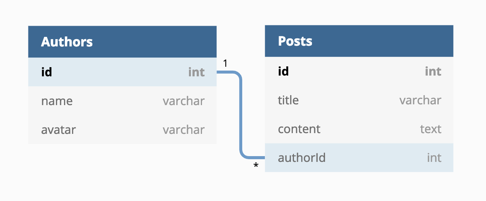

# GraphQL Server with Apollo

> Simple GraphQL server with Apollo supporting Query and Mutation

Tech stacks:

- [GraphQL](https://graphql.org/)
- [Apollo Server](https://www.apollographql.com/docs/apollo-server/)
- [SQLite 3](https://www.sqlite.org/index.html)
- [Sequelize](http://docs.sequelizejs.com/)

## Database Models

Database relationship: `one-to-many`

Thanks [dbdiagram](https://dbdiagram.io/) for online tool create database models and relationships

## Guide

1. Create SQLite file (if it not exist) at: `database/db.sqlite`
2. Install dependencies: `yarn install`
3. Migration DB: `yarn db:migration`
4. Seed data: `yarn db:seed`
5. Start server: `yarn server`

Enjoy!

*Note:* If you got error when you seed data (step 4), run `yarn db:drop` to drop all schema, then restart from step 3
